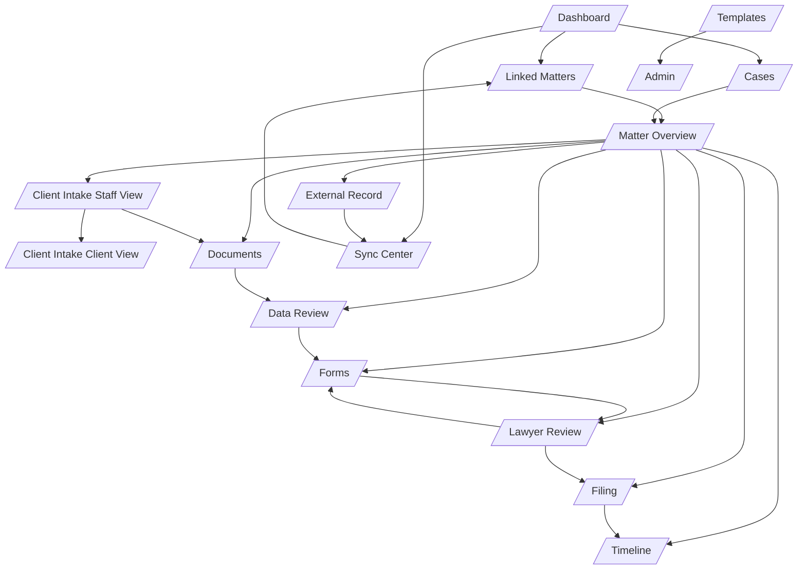

# Phase 2 Full UI UX Specification

## 1. Purpose
This document is the complete UI/UX specification for Phase 2. It defines personas, journeys, navigation, screens, information architecture, role-based actions, and UI-state behavior for implementation.

## 2. Product UX Principles
1. Linked-matter-first workflow is preferred, but case initiation must also be supported directly inside the application.
2. Workflow over record ownership: PMS remains system of record, this app is operations workspace.
3. Source transparency: key field values show source (PMS, Intake, OCR, Manual).
4. Explicit legal gates: irreversible decisions require explicit approval and rationale.
5. Sync trust is visible: sync health, conflicts, retry status, and audit trail are first-class.

## 2.1 Case Entry Modes
1. External-first entry
- A matter originates in PMS or another connected system and is linked into the application workspace.

2. Internal-first entry
- A case is created directly inside the application by assistant, lawyer, or admin and may optionally be linked to PMS later.

UI implications
1. The application must support both Linked Matters and internally created Cases in list and detail views.
2. Matter header must indicate origin: PMS-linked or Internal.
3. Internal-origin cases must display a clear CTA to link or publish to PMS when connector policy allows.
4. Filters, dashboards, and queues must support source-origin segmentation.

## 3. Personas and Goals

## 3.1 Assistant
Primary goals
1. Move cases from intake to review with minimal re-entry.
2. Resolve missing items, extraction exceptions, and unresolved form fields quickly.

Key success metrics
1. Time from linked matter to review-ready packet.
2. Number of unresolved items per case.

## 3.2 Lawyer
Primary goals
1. Review legal risk and contradictions efficiently.
2. Make safe approve or return decisions with defensible rationale.

Key success metrics
1. Review cycle time.
2. Return rate due to incomplete packet quality.

## 3.3 Client
Primary goals
1. Complete intake and uploads with low stress.
2. Understand status and what is needed next.

Key success metrics
1. Intake completion rate.
2. Clarification turnaround time.

## 3.4 Admin and Ops
Primary goals
1. Keep integrations healthy.
2. Govern templates, mappings, and access controls.

Key success metrics
1. Sync failure resolution time.
2. Config-change error rate.

## 4. Navigation Model

## 4.1 Global Navigation (left sidebar)
1. Dashboard
2. Linked Matters
3. Cases
3. Intake
4. Documents
5. Data Review
6. Forms
7. Review
8. Filing
9. Timeline
10. Sync Center
11. Templates
12. Admin

Access by role
1. Assistant: all except Admin configuration writes.
2. Lawyer: Dashboard, Linked Matters, Cases, Overview tabs, Review, Filing, Timeline, limited Documents/Data Review.
3. Client: no sidebar; only secure client flow pages.
4. Admin and Ops: all screens including connector and policy management.

## 4.2 Matter-Level Navigation (top tabs)
1. Overview
2. External Record
3. Client Intake
4. Documents
5. Data Review
6. Forms
7. Lawyer Review
8. Filing
9. Timeline
10. Sync Log

Matter header displayed on all tabs
1. External PMS badge and external matter ID.
2. Case stage rail with current and next stage.
3. Sync health and last sync timestamp.
4. Next action CTA and blocker count.

## 4.3 Client Navigation
1. Invite Landing
2. Intake Wizard
3. Document Upload
4. Clarification Requests
5. Progress Timeline
6. Declarations and Submit

## 4.4 Next.js Route Hierarchy and URL Conventions

Recommended App Router structure
1. `app/(staff)/dashboard/page.tsx`
2. `app/(staff)/linked-matters/page.tsx`
3. `app/(staff)/cases/page.tsx`
4. `app/(staff)/matters/[caseId]/layout.tsx`
5. `app/(staff)/matters/[caseId]/overview/page.tsx`
6. `app/(staff)/matters/[caseId]/external-record/page.tsx`
7. `app/(staff)/matters/[caseId]/intake/page.tsx`
8. `app/(staff)/matters/[caseId]/documents/page.tsx`
9. `app/(staff)/matters/[caseId]/data-review/page.tsx`
10. `app/(staff)/matters/[caseId]/forms/page.tsx`
11. `app/(staff)/matters/[caseId]/review/page.tsx`
12. `app/(staff)/matters/[caseId]/filing/page.tsx`
13. `app/(staff)/matters/[caseId]/timeline/page.tsx`
14. `app/(staff)/matters/[caseId]/sync-log/page.tsx`
15. `app/(staff)/sync-center/page.tsx`
16. `app/(staff)/templates/page.tsx`
17. `app/(staff)/admin/page.tsx`
18. `app/(client)/client/intake/[token]/page.tsx`
19. `app/(client)/client/intake/[token]/documents/page.tsx`
20. `app/(client)/client/intake/[token]/progress/page.tsx`

URL conventions
1. Use lowercase kebab-case for static route segments.
2. Use `[caseId]` and `[token]` for dynamic route segments.
3. Use query params for view state, never for resource identity.
4. Canonical query params:
- `tab`: secondary in-screen tabs where needed
- `filter`, `sort_by`, `sort_dir`: list state
- `page`, `page_size`: pagination
- `from`, `to`: date-range filters
- `q`: search term
- `drawer`: open side drawer state identifier
- `modal`: open modal state identifier
5. Use intercepting/modal routes only for deep-linkable approvals or conflict resolution dialogs if the team adopts them; otherwise keep modal state query-driven.
6. Staff routes require authenticated staff session and tenant context.
7. Client routes require signed token context and must not expose staff navigation.

Route ownership guidance
1. Layout-level data fetch:
- matter header summary
- stage rail
- sync health chip
2. Page-level data fetch:
- screen-specific resource collections and mutations
3. Component-level fetch:
- only for isolated widgets with independent refresh cadence, such as sync status mini-panels or activity counters

## 5. End-to-End User Journeys

## 5.1 Assistant Journey
1. Open Linked Matters or Cases and filter assigned work.
2. Open matter workspace and review Overview next action.
3. Launch or resume intake and monitor completion.
4. Manage Documents and send targeted document requests.
5. Resolve Data Review inconsistencies and approve extractions.
6. Generate forms, resolve unresolved fields, send to Lawyer Review.
7. If returned, apply corrections and resubmit.
8. If approved, coordinate Filing readiness and monitor timeline.

## 5.1.1 Internal Case Creation Journey
1. Assistant or lawyer opens Cases.
2. User clicks Create Case.
3. User enters minimum required case metadata: client identity, procedure intent or unknown, priority, origin notes.
4. System creates internal case and routes user to Matter Overview.
5. User may optionally trigger Link to PMS or continue fully within the application.

## 5.1.2 External Linked Matter Journey
1. Assistant opens Linked Matters and filters assigned matters.
2. User opens linked workspace from external matter row.
3. Workspace shows external origin badge, sync status, and mapped metadata.

## 5.2 Lawyer Journey
1. Open Dashboard approvals queue.
2. Enter Lawyer Review for a case.
3. Inspect legal summary, risks, contradictions, and source comparisons.
4. Decide Approve, Return, or Request Clarification.
5. For online filing, make Submit or Decline decision with rationale.

## 5.3 Client Journey
1. Open secure invite link from matter context.
2. Complete route-aware intake wizard.
3. Upload requested documents.
4. Respond to clarification requests.
5. Track progress in simplified timeline view.

## 5.4 Admin and Ops Journey
1. Monitor Sync Center and connector health.
2. Resolve failed sync and conflicts.
3. Manage templates and mappings.
4. Manage roles and permissions in Admin.

## 6. Screen Specifications

## 6.1 Dashboard
Route
- /dashboard

Displayed information
1. Priority queue of urgent tasks.
2. Matters by stage.
3. Cases by origin (PMS-linked vs Internal).
3. Pending lawyer approvals.
4. Filing deadlines.
5. Sync issues summary.
6. Recent client activity.

Allowed actions
1. Assistant: open case from queue, claim task, escalate blocker.
2. Lawyer: open approval task, return with comment, approve.
3. Admin and Ops: open sync issue, assign resolution owner.
4. Assistant and Lawyer: create new internal case.

Navigation
1. Entry: global sidebar.
2. Exit: deep-link to matter tabs and Sync Center.

API dependencies
1. A01 cases list and overview summaries.
2. A06 timeline summary.
3. A07 sync health summaries.

## 6.2 Cases
Route
- /cases

Displayed information
1. Internal-origin case list.
2. Optionally linked cases where origin is internal and later synchronized.
3. Client name, procedure, stage, priority, origin, and assignee.
4. Link-to-PMS status where relevant.

Allowed actions
1. Assistant and Lawyer: create case, open case, filter and sort.
2. Admin and Ops: bulk assign, inspect origin and linkability state.

Navigation
1. Entry: global sidebar.
2. Exit: Matter Overview, External Record when linked, Intake.

API dependencies
1. A01 GET /v1/cases.
2. A01 POST /v1/cases.

## 6.3 Linked Matters
Route
- /linked-matters

Displayed information
1. External system badge.
2. External matter ID and client.
3. Procedure type.
4. Current stage.
5. Sync health.
6. Assigned assistant and lawyer.

Allowed actions
1. Assistant and Lawyer: open workspace.
2. Admin and Ops: remap link, inspect sync history.

Navigation
1. Entry: global sidebar.
2. Exit: matter workspace tabs.

API dependencies
1. A01 GET /v1/cases.
2. A07 GET /v1/cases/{case_id}/external-record.

## 6.4 Matter Overview
Route
- /matters/{case_id}/overview

Displayed information
1. Client summary and procedure summary.
2. Origin badge: PMS-linked or Internal.
2. Stage rail and next action.
3. Missing items and blocker cards.
4. Risk flags and deadlines.
5. Recent activity feed.
6. PMS link CTA when case is internal and not yet linked.

Allowed actions
1. Assistant: trigger next operational step.
2. Lawyer: open review directly.
3. Admin and Ops: inspect health context.

Navigation
1. Entry: linked matters row or deep links.
2. Exit: any matter tab.

API dependencies
1. A01 GET /v1/cases/{case_id}/overview.
2. A06 GET /v1/cases/{case_id}/timeline.

## 6.5 External Record
Route
- /matters/{case_id}/external-record

Displayed information
1. External system and external IDs.
2. Field mapping table with local and external values.
3. Source badges and sync status per field.
4. Conflict panel.
5. Sync log and retry history.

Allowed actions
1. Assistant: propose conflict resolution.
2. Lawyer: approve sensitive conflict choices.
3. Admin and Ops: resolve conflict, retry failed sync, change mapping.

Navigation
1. Entry: matter tab.
2. Exit: Sync Log tab and Sync Center.

API dependencies
1. A07 external record, sync log, conflict resolve, retry.

## 6.6 Client Intake (Staff View)
Route
- /matters/{case_id}/intake

Displayed information
1. Intake status and progress.
2. Section completion map.
3. Missing answers.
4. Declarations status.

Allowed actions
1. Assistant: send invite, send reminder, request clarification.
2. Lawyer: read-only status visibility.

Navigation
1. Entry: matter tab and next-action links.
2. Exit: Documents and Data Review.

API dependencies
1. A02 intake submission status endpoints.
2. A02 document requests.

## 6.7 Client Intake (Client View)
Route
- /client/intake/{token}

Displayed information
1. Progress rail and remaining steps.
2. Route-specific questions.
3. Upload prompts.
4. Consent and declaration prompts.

Allowed actions
1. Client: save draft, submit section, upload artifacts, final submit.

Navigation
1. Entry: secure invitation link.
2. Exit: progress page and clarification page.

API dependencies
1. A02 intake submission.
2. A02 document upload.

## 6.8 Documents
Route
- /matters/{case_id}/documents

Displayed information
1. Required checklist by requirement.
2. Artifact grid with upload date and extraction status.
3. Expired and conflicting document alerts.
4. Translation and legalization markers.

Allowed actions
1. Assistant: upload, replace, request more docs, mark exception note.
2. Lawyer: read-only plus comment.
3. Client: upload through client route only.

Navigation
1. Entry: matter tab and alerts.
2. Exit: Data Review and Timeline.

API dependencies
1. A02 documents endpoints.
2. A03 extraction list summary.

## 6.9 Data Review
Route
- /matters/{case_id}/data-review

Displayed information
1. Canonical data sections: identity, address, family, work and study, history.
2. Source badge and confidence per field.
3. Inconsistency queue.
4. Correction history.

Allowed actions
1. Assistant: edit fields, resolve conflicts, approve extraction gate.
2. Lawyer: inspect source evidence and add review comments.

Navigation
1. Entry: matter tab and unresolved field links.
2. Exit: Forms and Lawyer Review.

API dependencies
1. A03 extraction list, patch, approve.
2. A04 requirements for completeness context.

## 6.10 Forms
Route
- /matters/{case_id}/forms

Displayed information
1. Applicable forms list by procedure.
2. Completion state and unresolved field count.
3. Form preview and export status.
4. Dependency checklist for packet readiness.

Allowed actions
1. Assistant: generate forms, edit unresolved fields, regenerate artifacts, send to review.
2. Lawyer: preview and annotate.

Navigation
1. Entry: matter tab and data review completion CTA.
2. Exit: Lawyer Review and Filing.

API dependencies
1. A05 forms generate/list/get/patch/approve.

## 6.11 Lawyer Review
Route
- /matters/{case_id}/review

Displayed information
1. Legal summary.
2. Red flags and contradictions.
3. Source document versus extracted value comparison.
4. Assistant notes and pending questions.

Allowed actions
1. Lawyer: approve, return with corrections, request clarification.
2. Assistant: view feedback and apply corrections.

Navigation
1. Entry: review queue and matter tab.
2. Exit: Forms or Filing based on decision.

API dependencies
1. A04 eligibility details.
2. A05 approve and decision endpoints.
3. A06 filing status.

## 6.12 Filing
Route
- /matters/{case_id}/filing

Displayed information
1. Submission readiness checklist.
2. Certificate and signature prerequisites.
3. Final packet references.
4. Submission references and timestamp.

Allowed actions
1. Lawyer: submit or decline decision for online flow.
2. Assistant: upload certificate metadata, finalize checklist.
3. Admin and Ops: investigate submission failures.

Navigation
1. Entry: post-approval flow.
2. Exit: Timeline and Sync Log.

API dependencies
1. A06 certificate and filing status.
2. A05 submit-decision.

## 6.13 Timeline
Route
- /matters/{case_id}/timeline

Displayed information
1. Intake milestones.
2. Upload and extraction events.
3. Review and filing decisions.
4. Authority responses and reminder events.
5. Sync events.

Allowed actions
1. Assistant and Lawyer: filter and inspect event details.
2. Admin and Ops: export timeline for audit.

Navigation
1. Entry: matter tab and global timeline.
2. Exit: deep links to source screens.

API dependencies
1. A06 timeline.
2. A07 sync log references.

## 6.14 Sync Center
Route
- /sync-center

Displayed information
1. Connector health and auth state.
2. Webhook activity.
3. Failed sync queue.
4. Conflict backlog.
5. Retry controls and replay history.

Allowed actions
1. Admin and Ops: retry, resolve, disable connector, adjust mappings.
2. Assistant and Lawyer: read scoped sync status.

Navigation
1. Entry: global sidebar.
2. Exit: Linked Matters and specific case external record.

API dependencies
1. A07 sync APIs.
2. A08 connector management.

## 6.15 Templates
Route
- /templates

Displayed information
1. Procedure templates.
2. Intake question sets.
3. Document rules.
4. Form bundles.
5. Review rules.

Allowed actions
1. Admin and Ops: create, version, activate, rollback templates.
2. Assistant and Lawyer: read active template versions.

Navigation
1. Entry: global sidebar.
2. Exit: preview impacted matters and Admin.

API dependencies
1. A08 template endpoints.

## 6.16 Admin
Route
- /admin

Displayed information
1. User and role assignments.
2. Integration settings and secret status.
3. Security policy controls.
4. Team analytics.

Allowed actions
1. Admin and Ops only: role updates, connector config, policy changes.

Navigation
1. Entry: global sidebar.
2. Exit: Sync Center and Templates.

API dependencies
1. A08 admin endpoints.

## 6.17 Screen Component Inventory

### Dashboard

| Component | Type | Displayed Attributes | Primary Actions | Endpoints |
|---|---|---|---|---|
| Priority Queue | table/card list | task title, case name, stage, due date, severity, assignee | open task, claim task, escalate | A01 GET /v1/cases |
| Stage Board | kanban/summary board | stage name, case count, aging summary | open filtered list | A01 GET /v1/cases |
| Approval Queue | card list | case, lawyer due date, unresolved items count | open review | A01 GET /v1/cases, A06 GET /v1/cases/{case_id}/timeline |
| Sync Issues Panel | side panel | connector name, issue count, latest failure time | open Sync Center | A07 sync summaries |

### Cases

| Component | Type | Displayed Attributes | Primary Actions | Endpoints |
|---|---|---|---|---|
| Cases Table | table | case id, client, procedure, origin, stage, priority, assignee, link status | sort, filter, open case | A01 GET /v1/cases |
| Create Case Modal | modal/form | client name, procedure intent, priority, origin notes | create case, cancel | A01 POST /v1/cases |
| Filters Bar | toolbar | search, origin filter, stage filter, assignee filter | apply/reset filters | A01 GET /v1/cases |

### Linked Matters

| Component | Type | Displayed Attributes | Primary Actions | Endpoints |
|---|---|---|---|---|
| Linked Matters Table | table | external system, external matter id, client, procedure, stage, sync health | open workspace | A01 GET /v1/cases |
| Row Action Menu | menu | remap availability, sync history availability | open external record, inspect sync history | A07 GET /v1/cases/{case_id}/external-record |
| Health Filter Bar | toolbar | connector status, sync state, assignee | filter list | A01 GET /v1/cases |

### Matter Overview

| Component | Type | Displayed Attributes | Primary Actions | Endpoints |
|---|---|---|---|---|
| Matter Header | persistent header | client, case id, origin badge, PMS id, stage, sync health, next action | open next step, open sync status | A01 GET /v1/cases/{case_id}/overview |
| Blockers Card | card | blocker code, severity, owner, due date | jump to blocking screen | A01 GET /v1/cases/{case_id}/overview |
| Risks and Deadlines | card/list | risk label, deadline label, due date, urgency | open review/timeline | A01 GET /v1/cases/{case_id}/overview |
| Activity Feed | timeline summary | event label, actor, timestamp | open timeline | A06 GET /v1/cases/{case_id}/timeline |

### External Record

| Component | Type | Displayed Attributes | Primary Actions | Endpoints |
|---|---|---|---|---|
| External Metadata Card | card | system name, external matter id, contact refs, last sync | open source links | A07 GET /v1/cases/{case_id}/external-record |
| Field Mapping Table | table | field key, local value, external value, source, status | inspect conflict | A07 GET /v1/cases/{case_id}/external-record |
| Conflict Resolution Drawer | drawer | conflicting values, source timestamps, precedence hints | use local, use external, merge, submit resolution | A07 POST /v1/cases/{case_id}/sync/conflicts/{conflict_id}/resolve |
| Sync Activity List | table/list | direction, operation, status, attempt count, occurred_at | retry failed sync | A07 GET /v1/cases/{case_id}/sync-log, A07 POST /v1/cases/{case_id}/sync/retry |

### Client Intake (Staff View)

| Component | Type | Displayed Attributes | Primary Actions | Endpoints |
|---|---|---|---|---|
| Intake Progress Card | card | completion percentage, current section, missing section count | open intake section | A02 intake status/submission |
| Section Completion Map | step rail/list | section title, status, last updated | navigate section | A02 intake status/submission |
| Clarification Panel | side panel | missing answers, last reminder sent, recipient status | send reminder, request clarification | A02 POST /v1/cases/{case_id}/document-requests |

### Client Intake (Client View)

| Component | Type | Displayed Attributes | Primary Actions | Endpoints |
|---|---|---|---|---|
| Wizard Stepper | wizard rail | current step, total steps, remaining estimate | navigate next/back | local UI state |
| Question Form | form | question label, helper text, current answer, validation | save draft, continue | A02 POST /v1/cases/{case_id}/intake/submissions |
| Upload Panel | upload zone | requested document label, uploaded count, upload status | upload document | A02 POST /v1/cases/{case_id}/documents |
| Declaration Step | form/checklist | consent text, declarations, completion status | final submit | A02 POST /v1/cases/{case_id}/intake/submissions |

### Documents

| Component | Type | Displayed Attributes | Primary Actions | Endpoints |
|---|---|---|---|---|
| Requirements Checklist | checklist/table | requirement code, status, mandatory flag, linked docs count | filter unresolved, jump to request | A02 GET /v1/cases/{case_id}/documents |
| Artifact Grid | grid/table | file name, document type, uploaded_at, extraction status, expiry alert | preview, replace, upload | A02 GET /v1/cases/{case_id}/documents, A02 POST /v1/cases/{case_id}/documents |
| Alert Strip | banner/list | expired docs, conflicting docs, missing translations | jump to item | A02 GET /v1/cases/{case_id}/documents |
| Request Composer | drawer/modal | missing items list, due date, message template, custom note | send request | A02 POST /v1/cases/{case_id}/document-requests |

### Data Review

| Component | Type | Displayed Attributes | Primary Actions | Endpoints |
|---|---|---|---|---|
| Domain Tabs | tabs | section names and unresolved counts | switch section | local UI state |
| Field Review Table | editable table/form | field key, value, source badge, confidence, last editor | edit field, save field | A03 GET /v1/cases/{case_id}/extractions, A03 PATCH /v1/cases/{case_id}/extractions/{artifact_id} |
| Inconsistency Queue | side panel | conflicting field, candidate values, source docs | resolve conflict | A03 PATCH /v1/cases/{case_id}/extractions/{artifact_id} |
| Approval Bar | sticky action bar | unresolved count, approval readiness, note field | approve extraction | A03 POST /v1/cases/{case_id}/extractions/approve |

### Forms

| Component | Type | Displayed Attributes | Primary Actions | Endpoints |
|---|---|---|---|---|
| Forms List | sidebar/list | form name, status, unresolved fields, submission mode | select form, generate forms | A05 GET /v1/cases/{case_id}/forms, A05 POST /v1/cases/{case_id}/forms/generate |
| Form Editor | form/editor | field groups, field values, source mapping, validation messages | edit field, save corrections | A05 GET /v1/cases/{case_id}/forms/{form_id}, A05 PATCH /v1/cases/{case_id}/forms/{form_id} |
| Preview Pane | preview panel | html/pdf preview state, official layout markers | switch preview mode, export | A05 GET /v1/cases/{case_id}/forms/{form_id} |
| Review Action Bar | sticky action bar | unresolved count, packet readiness, review note | send to review, regenerate | A05 POST /v1/cases/{case_id}/forms/generate |

### Lawyer Review

| Component | Type | Displayed Attributes | Primary Actions | Endpoints |
|---|---|---|---|---|
| Legal Summary Card | summary card | procedure option, readiness score, major issues | inspect details | A04 GET /v1/cases/{case_id}/eligibility/{assessment_id} |
| Contradictions Table | table | contradiction type, severity, evidence refs, status | open comparison | A04 GET /v1/cases/{case_id}/eligibility/{assessment_id} |
| Source Comparison Viewer | split viewer | extracted value, source snippet, source doc refs | annotate, inspect | A04 GET /v1/cases/{case_id}/eligibility/{assessment_id}, A05 GET /v1/cases/{case_id}/forms/{form_id} |
| Decision Footer | action bar/modal | rationale input, decision options, unresolved count | approve, return, request clarification | A05 POST /v1/cases/{case_id}/forms/{form_id}/approve, A05 POST /v1/cases/{case_id}/forms/{form_id}/submit-decision |

### Filing

| Component | Type | Displayed Attributes | Primary Actions | Endpoints |
|---|---|---|---|---|
| Readiness Checklist | checklist | prerequisite label, status, blocking reason | inspect blocker | A06 GET /v1/cases/{case_id}/filing/status |
| Certificate Card | card | certificate status, uploaded_at, purge status | upload certificate | A06 POST /v1/cases/{case_id}/certificate, A06 GET /v1/cases/{case_id}/filing/status |
| Submission Reference Panel | card/list | submission ref, receipt refs, submitted_at, latest status | open receipt/timeline | A06 GET /v1/cases/{case_id}/filing/status |
| Decision Modal | modal | decision summary, impact note, rationale field | submit, decline, cancel | A05 POST /v1/cases/{case_id}/forms/{form_id}/submit-decision |

### Timeline

| Component | Type | Displayed Attributes | Primary Actions | Endpoints |
|---|---|---|---|---|
| Event Timeline | grouped list | event type, summary, actor, occurred_at, artifact ref | expand event, deep link | A06 GET /v1/cases/{case_id}/timeline |
| Filter Bar | toolbar | actor filter, event type, date range, search | apply filters | A06 GET /v1/cases/{case_id}/timeline |
| Sync Events Drawer | drawer | sync event details, request ids, retry history | inspect sync event | A07 GET /v1/cases/{case_id}/sync-log |

### Sync Center

| Component | Type | Displayed Attributes | Primary Actions | Endpoints |
|---|---|---|---|---|
| Connector Health Grid | grid | connector name, status, last health check, latency | open connector, disable/enable | A08 GET/PATCH /v1/admin/connectors/{connector_id} |
| Failed Sync Queue | table | sync_event_id, connector, status, retry count, last error | retry, open case | A07 GET /v1/cases/{case_id}/sync-log, A07 POST /v1/cases/{case_id}/sync/retry |
| Conflict Backlog | table | case id, field, resolution status, owner | open resolve drawer | A07 GET /v1/cases/{case_id}/external-record, A07 POST /v1/cases/{case_id}/sync/conflicts/{conflict_id}/resolve |

### Templates

| Component | Type | Displayed Attributes | Primary Actions | Endpoints |
|---|---|---|---|---|
| Template List | table | template name, category, version, status | select template, filter | A08 GET /v1/admin/templates |
| Template Editor | editor/form | definition fields, version metadata, impact summary | save draft, activate, rollback | A08 POST /v1/admin/templates |
| Version History Panel | side panel | version number, created_by, created_at, status | compare version, rollback | A08 GET /v1/admin/templates |

### Admin

| Component | Type | Displayed Attributes | Primary Actions | Endpoints |
|---|---|---|---|---|
| User Role Table | table | user, current roles, workspace scope, status | assign roles, deactivate user | A08 GET /v1/admin/security/roles, A08 PATCH /v1/admin/security/users/{user_id}/roles |
| Connector Settings | form/cards | connector config summary, secret status, environment flags | update config | A08 GET/PATCH /v1/admin/connectors/{connector_id} |
| Policy Controls | settings form | policy name, current value, last changed by, last changed at | update policy | A08 admin endpoints |

## 7. Visual Navigation Map

## 8. Screen-to-Endpoint Matrix

| Screen | Primary Endpoints | Purpose |
|---|---|---|
| Dashboard | A01 GET /v1/cases, A06 GET /v1/cases/{case_id}/timeline, A07 sync summaries | Queue, stage, deadline, and sync overview |
| Cases | A01 GET /v1/cases, A01 POST /v1/cases | Internal case listing and creation |
| Linked Matters | A01 GET /v1/cases, A07 GET /v1/cases/{case_id}/external-record | Linked matter listing and sync context |
| Matter Overview | A01 GET /v1/cases/{case_id}/overview, A06 GET /v1/cases/{case_id}/timeline | Next action, blockers, stage, risks |
| External Record | A07 GET /v1/cases/{case_id}/external-record, A07 GET /v1/cases/{case_id}/sync-log, A07 POST /v1/cases/{case_id}/sync/retry, A07 POST /v1/cases/{case_id}/sync/conflicts/{conflict_id}/resolve | Source-of-record and sync management |
| Client Intake Staff View | A02 intake status/submission, A02 POST /v1/cases/{case_id}/document-requests | Invite, clarify, and track intake |
| Client Intake Client View | A02 POST /v1/cases/{case_id}/intake/submissions, A02 POST /v1/cases/{case_id}/documents | Complete intake and uploads |
| Documents | A02 POST /v1/cases/{case_id}/documents, A02 GET /v1/cases/{case_id}/documents, A02 POST /v1/cases/{case_id}/document-requests, A03 GET /v1/cases/{case_id}/extractions | Document collection and request loop |
| Data Review | A03 GET /v1/cases/{case_id}/extractions, A03 PATCH /v1/cases/{case_id}/extractions/{artifact_id}, A03 POST /v1/cases/{case_id}/extractions/approve, A04 GET /v1/cases/{case_id}/procedure/requirements | Canonical data validation and extraction approval |
| Forms | A05 POST /v1/cases/{case_id}/forms/generate, A05 GET /v1/cases/{case_id}/forms, A05 GET /v1/cases/{case_id}/forms/{form_id}, A05 PATCH /v1/cases/{case_id}/forms/{form_id} | Form generation, edit, preview |
| Lawyer Review | A04 GET /v1/cases/{case_id}/eligibility/{assessment_id}, A05 POST /v1/cases/{case_id}/forms/{form_id}/approve, A05 POST /v1/cases/{case_id}/forms/{form_id}/submit-decision | Review, approve, return, submit intent |
| Filing | A06 POST /v1/cases/{case_id}/certificate, A06 GET /v1/cases/{case_id}/filing/status, A05 POST /v1/cases/{case_id}/forms/{form_id}/submit-decision | Filing readiness and execution |
| Timeline | A06 GET /v1/cases/{case_id}/timeline, A07 GET /v1/cases/{case_id}/sync-log | Chronology and audit context |
| Sync Center | A07 sync endpoints, A08 GET/PATCH /v1/admin/connectors | Connector and sync operations |
| Templates | A08 GET /v1/admin/templates, A08 POST /v1/admin/templates | Template management |
| Admin | A08 GET /v1/admin/security/roles, A08 PATCH /v1/admin/security/users/{user_id}/roles, A08 connector endpoints | User, role, connector, and policy administration |

## 9. Role-Based Action Summary

| Screen | Assistant | Lawyer | Client | Admin and Ops |
|---|---|---|---|---|
| Dashboard | work queue actions | approval queue actions | none | sync and ops overview |
| Cases | create, open, filter | create, open, filter | none | assign and inspect origin |
| Linked Matters | open and filter | open and filter | none | remap and health triage |
| Overview | execute next action | review readiness | none | inspect health |
| External Record | propose resolution | approve sensitive resolution | none | resolve and retry |
| Intake (Staff) | invite and clarify | view | none | supervise |
| Intake (Client) | none | none | complete and submit | none |
| Documents | upload and request | comment | upload via client portal | supervise and audit |
| Data Review | edit and approve extraction | inspect and comment | none | supervise |
| Forms | generate and correct | annotate | none | supervise |
| Lawyer Review | consume feedback | approve or return | none | supervise |
| Filing | checklist and certificate assist | submit or decline | none | investigate failures |
| Timeline | inspect and filter | inspect and filter | simplified timeline | export and audit |
| Sync Center | read-only scoped | read-only scoped | none | full control |
| Templates | read active | read active | none | full control |
| Admin | none | none | none | full control |

## 10. Screen State Matrix

| Screen | Loading State | Empty State | Partial Data State | Conflict State | Error State | Success/Ready State |
|---|---|---|---|---|---|---|
| Dashboard | Skeleton cards for queue, stage board, deadlines | No active work with quick links to create/open cases | Sync widgets degraded, queue still visible | Not applicable | Global retry banner with request ID | Queue and stage board fully interactive |
| Cases | Table skeleton and filter placeholders | No internal cases with `Create Case` CTA | Some linked metadata unavailable | Origin/linkability mismatch warning | List fetch retry and diagnostics | Sorted/filterable case list |
| Linked Matters | Table skeleton and sync badges pending | No linked matters with guidance to connect PMS | Connector degraded, row-level data incomplete | Link mapping mismatch banner | Connector error with retry path | Linked rows open workspaces successfully |
| Matter Overview | Summary cards skeleton | Minimal new case state with next-step CTA | Missing risk/deadline sections due to delayed services | Blocker banner with jump actions | Overview fetch retry with request ID | Next action and stage fully resolved |
| External Record | Field mapping table skeleton | No external link present, show `Link to PMS` CTA | Some fields missing source or last-sync info | Compare-and-resolve drawer active | Sync detail fetch/retry failure | All mapped fields in sync or queued |
| Client Intake Staff | Intake progress skeleton | Invite not yet sent with `Send Invite` CTA | Some sections submitted, others pending | Clarification-needed banner with deep links | Reminder/send failure with retry | Intake complete and ready for documents/data review |
| Client Intake Client | Wizard skeleton | No started sections, show intro and expectations | Saved draft with pending sections highlighted | Validation conflicts per section | Submission/upload failure with recoverable retry | Submitted intake with progress confirmation |
| Documents | Checklist and grid skeleton | No documents uploaded with upload CTA | Some docs processed, some pending extraction | Requirement/document mismatch panel | Upload or list refresh failure | Checklist satisfied or clearly actionable |
| Data Review | Form section skeleton | No extracted data yet, waiting for processing | Some fields unresolved or low-confidence | Inconsistency queue visible with resolution actions | Save/approve failure with preserved edits | Canonical profile validated and extraction approved |
| Forms | Form list and preview skeleton | No forms generated with `Generate Forms` CTA | Generated forms with unresolved fields | Field-value conflict between source and form | Generate/update failure with retry | Forms ready or approved |
| Lawyer Review | Summary and comparison skeleton | Nothing awaiting review | Some evidence or summary sections delayed | Contradictions highlighted with mandatory disposition | Decision submit failure with rationale preserved | Approved, returned, or clarification requested |
| Filing | Readiness checklist skeleton | Filing not yet unlocked | Certificate or receipt data delayed | Submission blocked due to unresolved prerequisite | Submission/status fetch failure | Ready, submitted, or receipt captured |
| Timeline | Event list skeleton | No events yet on new case | Some event sources delayed | Conflicting event chronology warning | Timeline query failure | Unified chronology with deep links |
| Sync Center | Health panel skeleton | No connectors configured | Some connectors degraded | Conflict backlog requiring intervention | Connector API failure | Healthy or explicitly degraded with operator actions |
| Templates | Template list skeleton | No templates in category with create CTA | Some versions unavailable | Version activation collision warning | CRUD failure with retry | Active template versions visible |
| Admin | Settings panel skeleton | No scoped users/connectors due to setup gap | Partial settings due to permission limits | Role/policy change conflict requiring reload | Save failure with audit reference | Policies and assignments updated |

## 11. Screen Action-to-Permission Mapping

| Screen | User Action | Permission | Primary Roles | Workflow Guard | Endpoint |
|---|---|---|---|---|---|
| Dashboard | Open case from queue | case.read | Assistant, Lawyer, Admin and Ops | none | A01 GET /v1/cases |
| Dashboard | Create internal case | case.update | Assistant, Lawyer, Admin and Ops | none | A01 POST /v1/cases |
| Cases | Create case | case.update | Assistant, Lawyer, Admin and Ops | none | A01 POST /v1/cases |
| Cases | Open case | case.read | Assistant, Lawyer, Admin and Ops | none | A01 GET /v1/cases |
| Linked Matters | Open linked workspace | case.read | Assistant, Lawyer, Admin and Ops | none | A01 GET /v1/cases |
| External Record | Resolve sync conflict | sync.resolve | Lawyer, Admin and Ops | any non-closed state | A07 POST /v1/cases/{case_id}/sync/conflicts/{conflict_id}/resolve |
| External Record | Retry failed sync | sync.resolve | Admin and Ops | any non-closed state | A07 POST /v1/cases/{case_id}/sync/retry |
| Client Intake Staff | Send clarification request | case.update | Assistant, Admin and Ops | INTAKE_IN_PROGRESS or WAITING_FOR_CLIENT_INFO | A02 POST /v1/cases/{case_id}/document-requests |
| Client Intake Client | Submit intake | intake.submit | Client, Admin and Ops | INTAKE_IN_PROGRESS or WAITING_FOR_CLIENT_INFO | A02 POST /v1/cases/{case_id}/intake/submissions |
| Documents | Upload document | document.upload | Assistant, Client, Admin and Ops | DOCUMENT_COLLECTION_IN_PROGRESS or WAITING_FOR_CLIENT_INFO | A02 POST /v1/cases/{case_id}/documents |
| Documents | Request more documents | case.update | Assistant, Admin and Ops | DOCUMENT_COLLECTION_IN_PROGRESS | A02 POST /v1/cases/{case_id}/document-requests |
| Data Review | Edit extracted field | extraction.review | Assistant, Admin and Ops | EXTRACTION_REVIEW_PENDING | A03 PATCH /v1/cases/{case_id}/extractions/{artifact_id} |
| Data Review | Approve extraction | extraction.approve | Assistant, Lawyer, Admin and Ops | EXTRACTION_REVIEW_PENDING | A03 POST /v1/cases/{case_id}/extractions/approve |
| Forms | Generate forms | form.edit | Assistant, Admin and Ops | FORM_FILLING_IN_PROGRESS or READINESS_REVIEW_PENDING | A05 POST /v1/cases/{case_id}/forms/generate |
| Forms | Edit unresolved field | form.edit | Assistant, Admin and Ops | FORM_FILLING_IN_PROGRESS or FORM_REVIEW_PENDING | A05 PATCH /v1/cases/{case_id}/forms/{form_id} |
| Lawyer Review | Approve form/review gate | form.approve | Lawyer, Admin and Ops | FORM_REVIEW_PENDING | A05 POST /v1/cases/{case_id}/forms/{form_id}/approve |
| Lawyer Review | Return with corrections | form.approve | Lawyer, Admin and Ops | FORM_REVIEW_PENDING | A05 POST /v1/cases/{case_id}/forms/{form_id}/approve |
| Filing | Upload certificate | certificate.upload | Assistant, Lawyer, Admin and Ops | AWAITING_DIGITAL_CERTIFICATE or FORM_APPROVED | A06 POST /v1/cases/{case_id}/certificate |
| Filing | Submit filing decision | filing.decide | Lawyer, Admin and Ops | FORM_APPROVED | A05 POST /v1/cases/{case_id}/forms/{form_id}/submit-decision |
| Timeline | Export or inspect audit chronology | audit.read | Lawyer, Admin and Ops, limited Assistant | none | A06 GET /v1/cases/{case_id}/timeline |
| Sync Center | Manage connector | connector.manage | Admin and Ops | none | A08 PATCH /v1/admin/connectors/{connector_id} |
| Templates | Activate or update template | template.manage | Admin and Ops | none | A08 POST /v1/admin/templates |
| Admin | Assign roles | user.role_assign | Admin and Ops | none | A08 PATCH /v1/admin/security/users/{user_id}/roles |

## 12. UI State Behavior
Every screen must implement these states:
1. Loading: skeleton layout preserving final structure.
2. Empty: contextual guidance and primary action.
3. Partial data: warning banner with degraded source details.
4. Conflict: compare-and-resolve controls.
5. Error: retry and escalation actions with request ID visibility.

## 13. Accessibility and Usability Requirements
1. WCAG AA contrast and visible focus indicators.
2. Full keyboard navigation for all critical actions.
3. ARIA labels and live-region announcements for async updates.
4. Confirmation dialogs for irreversible actions (approve, submit, resolve-conflict).
5. Clear destructive-action language and reversible pathways when possible.

## 14. Telemetry and UX Metrics
Required events
1. queue_item_opened
2. document_request_sent
3. extraction_field_corrected
4. extraction_approved
5. form_generated
6. form_correction_saved
7. review_decision_submitted
8. filing_decision_submitted
9. sync_conflict_resolved
10. template_version_activated

KPIs
1. Time-to-review-ready per case.
2. Lawyer review turnaround time.
3. Clarification loop count per case.
4. Sync conflict resolution time.
5. Submission success without manual rework.

## 15. Traceability
1. This spec maps to UI/UX features U01-U12.
2. API bindings map to A01-A08 in api-contract-spec.md and api-field-contracts.md.
3. Role actions map to permissions-matrix.csv and security-access-spec.md.
